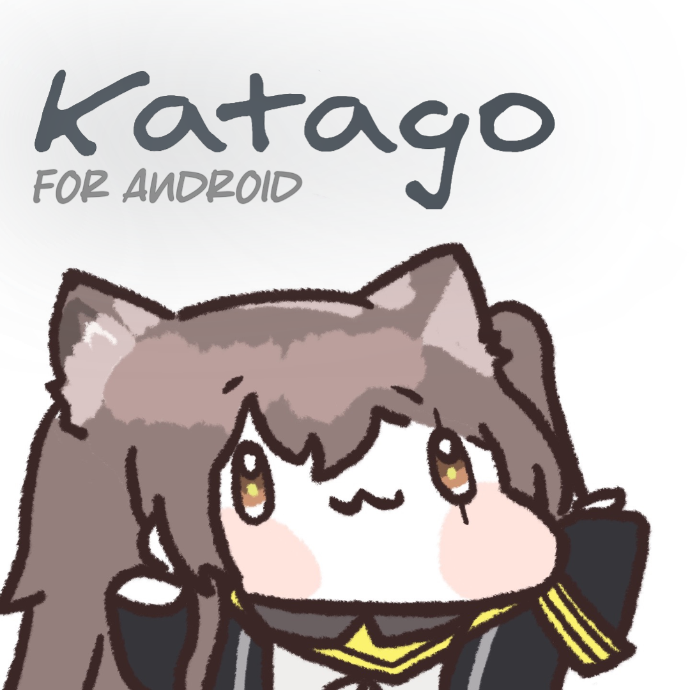
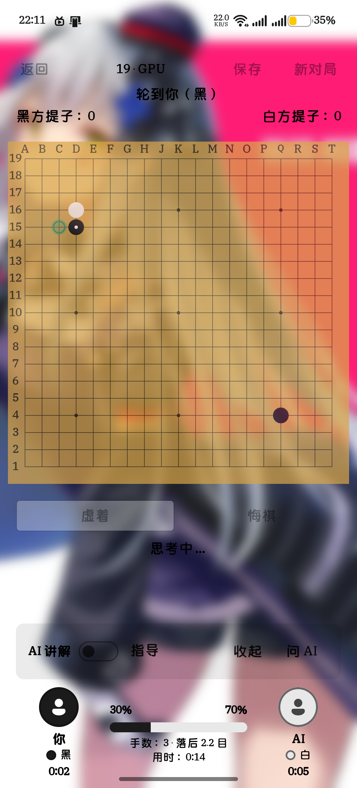
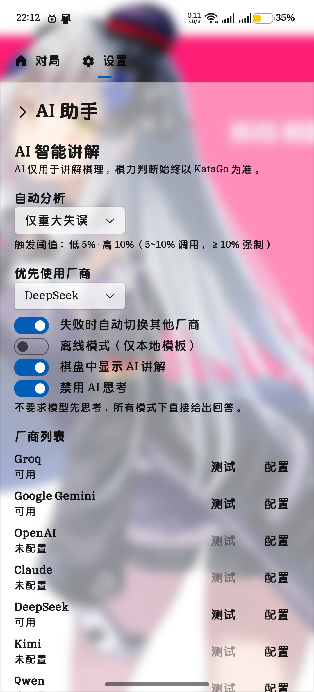
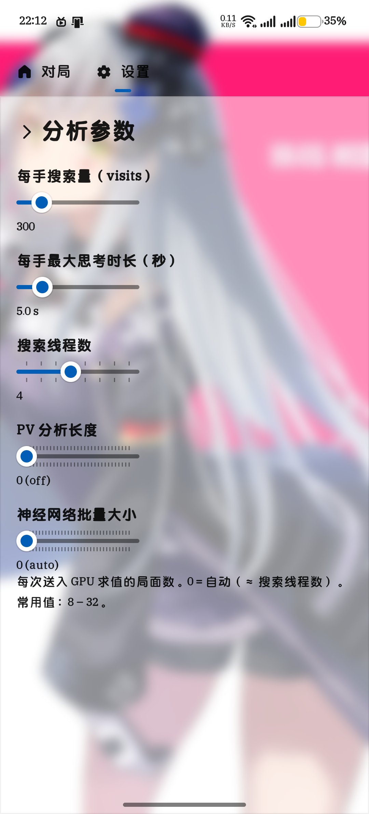
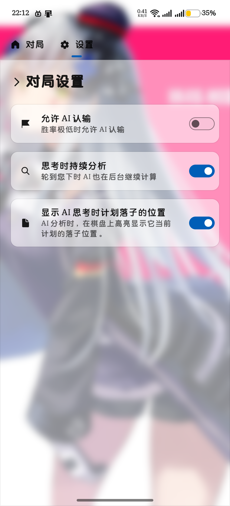
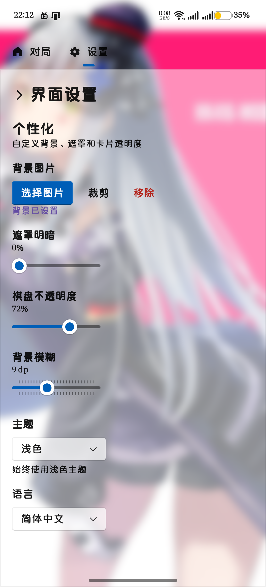
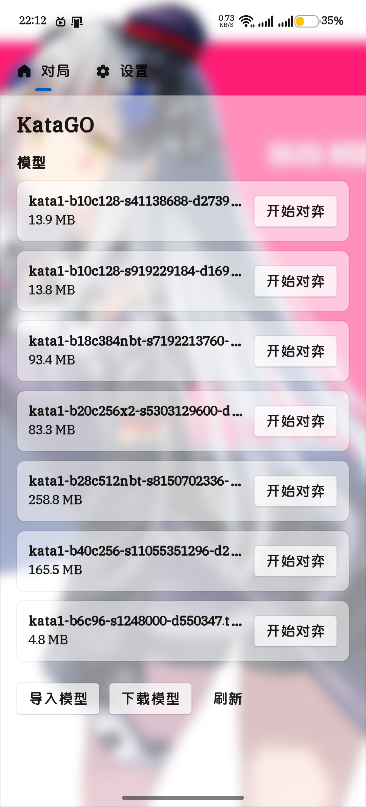
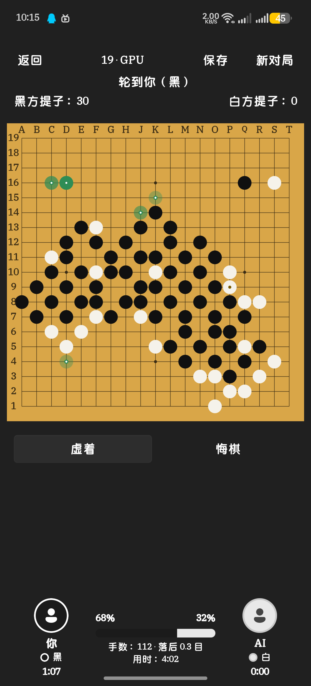
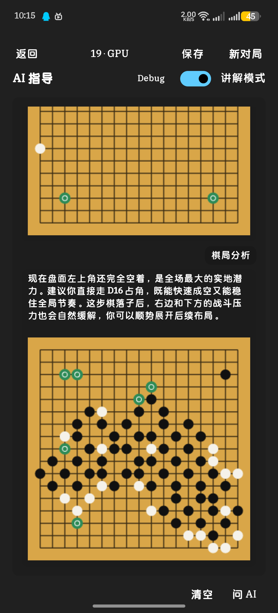

<p align="center">
  
</p>

<h1 align="center">KataGO Android — Super-Repo</h1>

<p align="center">
  <strong>Jetpack Compose + Fluent UI Go client with embedded KataGo engine and multi-provider AI commentary</strong>
</p>

<p align="center">
  
  
  
  
  
</p>

<p align="center">
  <a href="#features">Features</a> •
  <a href="#super-repo-structure">Super-Repo</a> •
  <a href="#quick-start">Quick Start</a> •
  <a href="#build">Build</a> •
  <a href="#ai-commentary">AI Commentary</a>
</p>

<p align="center">
  <a href="KataGO_Android/README.md">📖 中文详细文档 → KataGO_Android/README.md</a>
</p>

---

## Overview

KataGO Android is an Android Go (Weiqi/Baduk) client with a built-in KataGo engine. It supports local CPU/GPU play and AI-powered game commentary via multiple LLM providers. This repository is a **super-repo** that aggregates all required components as vendor copies (arm64-v8a only).

> **App version:** 1.0.4 (versionCode 20260916) · **KataGo:** vendor copy of `main` · **Platform:** `arm64-v8a` only

---

## Features

- **Human vs. Engine:** 9/13/19 boards, color selection, handicap, pass/undo/scoring
- **Dual engine:**
  - CPU `libkatago.so` — standalone process via `exec()`, GTP pipe
  - GPU `libkatago_opencl.so` — shared library loaded via JNI in app process, GTP pipe
- **GPU via clvk:** OpenCL on Vulkan (`libOpenCL.so` from clvk); auto fallback to CPU if not installed
- **AI commentary:** Groq / Gemini / OpenAI / Claude / DeepSeek / Kimi / Qwen / OpenRouter — auto analysis of mistakes, winrate/score, chat Q&A
- **Mistake detection:** threshold on KataGo winrate delta, only calls LLM when needed
- **Request queue & routing:** priority `user > blunder > turning point > mistake > fight > good move`, auto discard stale, auto failover (`manual / auto / round-robin / fastest / cheapest`)
- **Security:** Android Keystore + AES-GCM, Token usage tracking
- **Board UX:** tap-preview + confirm, AI pondering marks, coordinates, game save/load, model import, multi-language (zh-CN/zh-TW/en/ja/ko/de)

---

## Preview

<p align="center">
  
  
  
  
</p>
<p align="center">
  
  
  
  
</p>

---

## Tech Stack

| Layer | Technology |
|-------|------------|
| UI | Jetpack Compose + Fluent UI |
| Async | Kotlin Coroutines + Flow |
| Network | HttpURLConnection |
| Storage | SharedPreferences + Android Keystore |
| Engine | KataGo (`KataGo/cpp`, `USE_BACKEND=OPENCL`) |
| GPU | clvk (OpenCL on Vulkan) |

---

## Super-Repo Structure

This repo uses vendor copies so that `KataGo` source can be edited directly in the super-repo. Sync is done by replacing directories from upstream zips.

```
KataGO_Android-source/          # super-repo (this repo)
├── KataGo/                     # vendor copy of https://github.com/lightvector/KataGo#main (editable)
├── vulkan-build/clvk/          # vendor copy of https://github.com/kpet/clvk#main
├── build-tools/
│   ├── opencl-headers/         # vendor copy of https://github.com/KhronosGroup/OpenCL-Headers#main
│   ├── android-toolchain.cmake # arm64-v8a, NDK autodetect (r25b and newer)
│   ├── build-android-opencl.sh # build libkatago_opencl.so
│   ├── android-clang / android-clang++ # NDK wrappers
│   └── sync-vendor.sh          # sync from upstream zips
├── KataGO_Android/             # native Android app
│   ├── app/src/main/kotlin/com/chuishui/katago/
│   ├── app/src/main/jniLibs/arm64-v8a/
│   └── gradle/
└── README.md
```

> `KataGo-1.17.2` has been renamed to `KataGo` to track `main` without a version suffix.

---

## Quick Start

### Prerequisites

| Tool | Version |
|------|---------|
| Android SDK | compileSdk 35, minSdk 29, targetSdk 35 |
| Android NDK | r25b or newer (autodetected via `ANDROID_NDK` / `ANDROID_NDK_HOME` / `../ndk/android-ndk-r*`) |
| JDK | 11+ |
| Gradle | 8.11.1 via wrapper (`./gradlew`) |

### Clone

```bash
git clone <super-url> KataGO_Android-source
cd KataGO_Android-source

# only needed after clvk upstream update
git -C vulkan-build/clvk submodule update --init --recursive
```

### Build Engine (GPU, optional)

```bash
# NDK autodetected; or export ANDROID_NDK=/path/to/ndk
./build-tools/build-android-opencl.sh
# output: KataGO_Android/app/src/main/jniLibs/arm64-v8a/libkatago_opencl.so
```

### Build APK

```bash
cd KataGO_Android
./gradlew assembleDebug
# or from super-repo: ./KataGO_Android/build.sh assembleDebug
# output: KataGO_Android/app/build/outputs/apk/debug/app-debug.apk
```

#### Built-in full driver variant (offline, no download needed)

Standard APK keeps a 20KB stub at `app/src/main/jniLibs/arm64-v8a/libOpenCL.so` and downloads the full driver (≈75MB stripped) at runtime from `https://download.chuishui.top/libOpenCL.so`.

For a fully offline APK where `libOpenCL.so` is bundled and the import UI is hidden:

```bash
# Full driver already at app/builtinLibs/arm64-v8a/libOpenCL.so (75MB stripped via llvm-strip)
# Stub stays at app/src/main/jniLibs for standard builds
./gradlew assembleDebug -PKATA_BUILTIN_CLVK=true
# or release (signed)
./gradlew assembleRelease -PKATA_BUILTIN_CLVK=true -PKATA_ANDROID_KEYSTORE_PASSWORD=xxx -PKATA_ANDROID_KEY_PASSWORD=xxx
# output: ~67MB APK (vs 38MB standard) with lib/arm64-v8a/libOpenCL.so = 78MB
```

`KATA_BUILTIN_CLVK=true` sets `BuildConfig.BUILTIN_CLVK=true` and the `prepareBuiltinClvk` task temporarily overlays `builtinLibs` onto `jniLibs` before `merge*JniLibFolders`; at runtime `MainActivity.hasBuiltinDriver()` (`nativeLibraryDir/libOpenCL.so` valid aarch64 ELF >1MB) hides **Settings → OpenCL** and the onboarding **Vulkan** step, and disables download/import.

Release signing (optional, via Gradle properties):

```properties
KATA_ANDROID_KEYSTORE=/path/to/keystore.jks
KATA_ANDROID_KEYSTORE_PASSWORD=...
KATA_ANDROID_KEY_ALIAS=...
KATA_ANDROID_KEY_PASSWORD=...
```

### Import Model

Place KataGo weight files (`.bin.gz`) in:

```
/storage/emulated/0/Download/KataGO-AOS/model/
```

or import via in-app file picker.

### GPU / clvk

- **Standard (stub):** Import a clvk-built `libOpenCL.so` via **Settings → GPU** file picker (`.zip` or `.so` from `build-tools/install-clvk-lib.sh`) or let the app download it from `https://download.chuishui.top/libOpenCL.so` (onboarding). Without it, GPU mode is disabled and engine falls back to CPU.
- **Built-in (full):** No import needed — driver is already inside the APK (see built-in variant above).

```bash
# after building clvk via GitHub Actions artifact
./build-tools/install-clvk-lib.sh /path/to/libOpenCL-clvk-arm64-v8a.zip
```

---

## Build Details

- **Toolchain:** `build-tools/android-toolchain.cmake` — `arm64-v8a` only, `CMAKE_SYSTEM_NAME=Android`, API 29
- **Engine cmake:** `build-tools/build-android-opencl.sh` runs `cmake -DUSE_BACKEND=OPENCL -DNDK=...` then `ninja`, patches ELF `DT_FLAGS_1` (clear PIE) and `.init_array` garbage, installs to `jniLibs/arm64-v8a`
- **App:** `KataGO_Android/app/build.gradle.kts:18` has `abiFilters += "arm64-v8a"` and `packaging.jniLibs.useLegacyPackaging = true`

---

## AI Commentary Architecture

```
KataGo Engine
     ↓
GoMistakeDetector (winrate delta)
     ↓
GoAiEvent → GoAiCoach → GoAiPromptBuilder
     ↓
AiRouter (BEST / AUTO / CHEAPEST / MANUAL per event type)
     ↓
AiRequestQueue (priority, discard stale)
     ↓
AiProvider → UI
```

**Detection thresholds:**

| Mode | Threshold | Behavior |
|------|-----------|----------|
| OFF | — | never |
| MAJOR_MISTAKES | ≥10% | blunders only |
| IMPORTANT_MISTAKES | ≥5% | blunders + mistakes |
| AGGRESSIVE | ≥3% | almost every move |

**Routing per event:**

| Event | Policy |
|-------|--------|
| BLUNDER | BEST |
| mistake / turning point / fight | AUTO |
| GOOD_MOVE | CHEAPEST |
| user question / summary | MANUAL / AUTO |

**Modes:**
- **Commentary** (bottom panel): explains KataGo data (`answer()`, compact context)
- **Tutor** (full-screen): model reasons alone (`answerGlobal()`, `maxTokens=6000`, `reasoningEffort=high`, board JSON, `[tip]D4[/tip]` highlights)

---

## Vendor Sync Workflow

```bash
# sync from upstream zips (requires network, curl/wget + unzip)
./build-tools/sync-vendor.sh
# or manually download and replace:
# KataGo: https://github.com/lightvector/KataGo/archive/refs/heads/main.zip -> KataGo/
# clvk: https://github.com/kpet/clvk/archive/refs/heads/main.zip -> vulkan-build/clvk/
# OpenCL-Headers: https://github.com/KhronosGroup/OpenCL-Headers/archive/refs/heads/main.zip -> build-tools/opencl-headers/

# review and commit
git status --short
git add -A && git commit -m "vendor: sync upstream main"
```

> To switch to `git subtree` later:
> `git subtree add --prefix=KataGo https://github.com/lightvector/KataGo.git main --squash`

---

## Configuration

Configure LLM providers in **Settings → AI Assistant**: provider, Base URL, API Key (Keystore-encrypted), model, test connection. Failover across configured providers is automatic.

---

## License

- App code: see repository license
- KataGo engine (`KataGo/`): KataGo license (`KataGo/LICENSE`)
- clvk (`vulkan-build/clvk/`): its original license

## Acknowledgments

- [KataGo](https://github.com/lightvector/KataGo) by lightvector
- [clvk](https://github.com/kpet/clvk) — OpenCL on Vulkan
- Khronos OpenCL Headers
